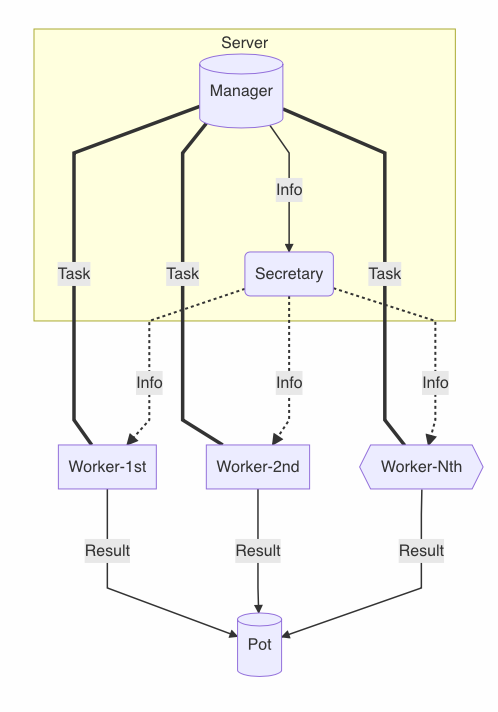
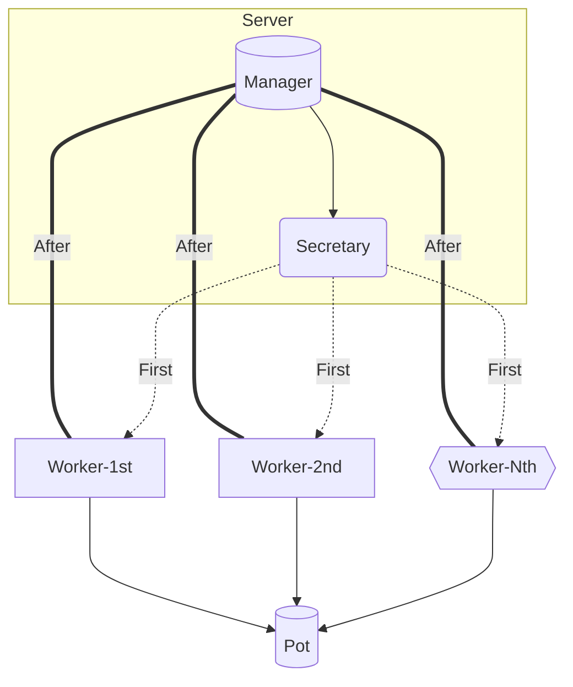

#### Steps to install

* clone git
* You must have install pip installer. You can find it here https://pypi.org/project/pip/ .
* Install new Virtual Enviroment to avoid changes in your system:
  *  `$ python3 -m venv /path/to/new/virtual/environment`
* Activate Virtual Enviroment
  *  `$ source /path/to/venv/bin/activate` 
* Go to donwloaded package.
  *  `$ cd Lattice_SVP`
* The package requires some libs, you can run the following command to install them
  * `$ pip install -r requires.txt`
* To install the package
  * `$ python setup.py develop`

#### Run Simulator

Just run `$ simulator -D 2 -B test` this command runs a test basis with Tree Enumeration Depth equals 2.

To simulate the operation, we have create an app which executes all the modules together. The operation of simulator includes the followings...

* It opens the manager and secretary module, which you can setting up by yourself. You can see the options if you run `$ manager --help `. Manager (module) informs secretary with problem's specification, after that secretary broadcasts the information of problem, and secretary will finish its job when the manager just have done its work.

* Simultaneously, opens by default 3 workers (ofcourse you can set whatever number of worker you prefer, but need to care about your system's seeds). Firstly the workers take information  (Basis, GSO Coefficients and GH Range) about the problem by secretary, after that connect to manager to receive the task and solve the problem with a usage of a parallel implementation, each time they finish their task, just need to re-connect with the manager (not secretary again) and receive a new task. The algorithm behind the implementation is an enumeration algorithm of Schnorr and Euchner.

*  The pot is the receiver of workers results. Also you can verify that the result is acceptable by using a pot's module which runs FPYLLL algorithm.

  Ηighly recommend the usage of `--help` flag in each module.

  `$ simulator -h`,   `$ manager -h`, `$ worker -h` and `$ pot -h`

#### If you want to compile cython code by your self, need to...

* For cpp modules:
  * Have install cpp libraries **boost** and **zmq**. Open `nano system_paths.json` and modify the json file, according to your system configuration. So you need to edit the paths of `'g++'` and set yours gcc compiler, `'zmq'` and `'boost'` paths. The default configuration have setting up according to Mac OS.
  * You can find static library file in `src/cpp_Lattice_SVP/libs` and the code of cpp implementations at `src/cpp_Lattice_SVP/include`.
  * If you want you can modify cpp code but have to recompile it, after modification. You can use the Makefile.
    * Go to file `include` with the following command. `cd src/cpp_Lattice_SVP/include`.
    * To remove the previous version of cpp code need to run `make clean`
    * To compile use just run  `make`.
* To compile cython's code, need to...
  * `$ cd src`
  * `$ python cython_setup.py build_ext -i`

##### Below is presented a work flow

