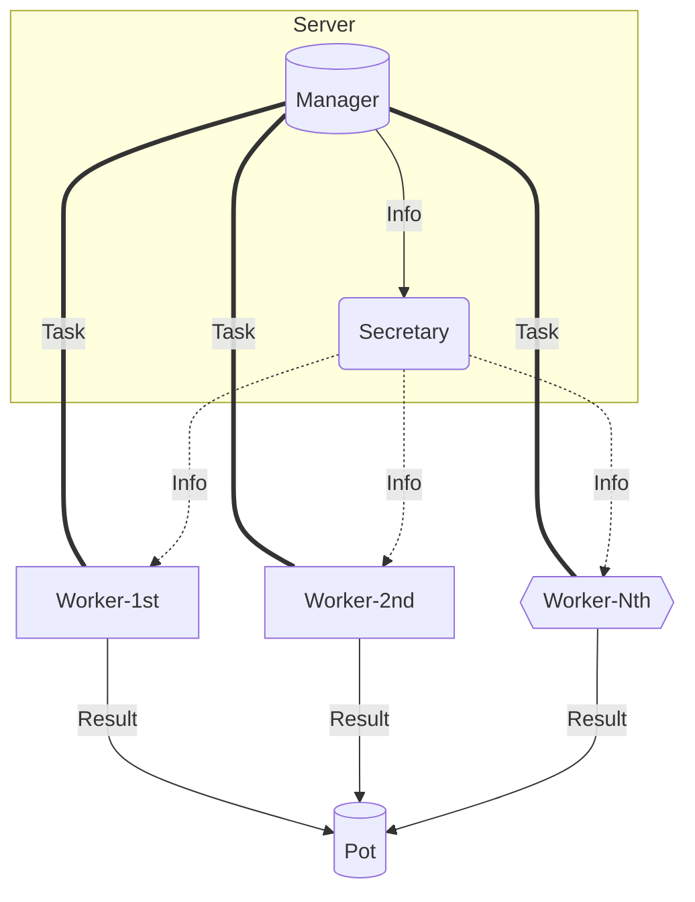

#### Steps to install... for linux users

* Clone git.
  * `git clone https://github.com/szZzr/Lattice-SVP.git`
* You must have install the pip installer. You can find it here https://pypi.org/project/pip/ . *MacOS users need to follow the instuctions below, but instead of pip-installer they can use brew-installer.* 
  * `$ sudo apt-get update`
  * `$ sudo apt-get upgrade`
  * `$ sudo apt install python3-pip`
* Install new Virtual Enviroment to avoid changes to your system:
  * `$ sudo apt-get install python3-venv`
  * `$ python3 -m venv /path/to/new/virtual/enviroment_name`
* Activate Virtual Enviroment
  *  `$ source /path/to/enviroment_name/bin/activate` 
* The package requires some libraries, you can run the following command to install them, this procedure may takes a few minutes. But if you don't satisfy the requirements for FPYLLL package installation, you have follow the instructions bellow and then you could run the command. 
  * `$ pip install -r requires.txt`

Now you just have sattisfy the requirements for the package installation. The steps below subscribe how you can install our Lattice-SVP package. The package installation splits in three parts. The first one reference to build the cpp's static library according to your system's preferences. Then need to build the cython's shared objects and in the end to install Lattice-SVP package.

* *Build CPP's Static Library* `libMyTool.a` .
* *Build cython's modules*.
* Go to package file `/Lattice-SVP` and run
  `python setup.py develop`

##### FPYLLL lib Installation

You can follow the instructions about installation of FPYLLL through official library's github repository, you can find it here (https://github.com/fplll/fpylll). But for your convenience we quote some instructions.

* Need to have install GCC compiler.
  * `sudo apt-get update`
  * `sudo apt-get install build-essential`
  * To verify that you have install succesfully the GCC compiler, use `$ gcc --version we need a version >=9.
    * sudo add-apt-repository ppa:ubuntu-toolchain-r/test
    * sudo apt-get update
    * sudo apt-get install gcc-10
    * sudo apt-get install g++-10
  
* Install GMP, MPFR, MPC.
  * `$ sudo apt-get install libgmp3-dev libmpfr-dev libmpc-dev`
  
* Install fplll. (This procedure takes a few minutes)
  * `$ sudo apt-get install libtool autoconf pkg-config fplll-tools`
  * Suppose that you have already activate the Virtual Enviroment, if you not, do it! (following the instruction above). After that need to install some depedencies due fplll installation.
    * `$ cd /path/to/dir/of/gitclone/Lattice-SVP`
    * `$ export PKG_CONFIG_PATH=$VIRTUAL_ENV/lib/pkgconfig`
    * `$ export LD_LIBRARY_PATH=$VIRTUAL_ENV/lib`
    * `$ ./install-dependencies.sh $VIRTUAL_ENV`
  
* Modify the virtual enviroment configuration to include the system's paths.

##### Build CPP's Static Library

* If you don't have install the ZeroMQ, Boost and OpenMP libraries, here is a command for linux installation.
  * `sudo apt-get install libzmq3-dev libboost-all-dev libomp5 libomp-dev`
* `$ cd path/to/Lattice-SVP/src/cpp_Lattice_SVP/include`
* `$ nano Makefile`
* This opens the compiler's instruction to create the static library. Everything is preset for you, the only think you need to do, is to change the `$INCLUDES` and the `$LIBRARIES` according with your system paths. So, need to find your system's `libboost_serialization` and `libzmq` includes and libs and you can replace according the default settings. *To find these files you can use `whereis`, `locate`, `mdfind`, etc... but suggest you to advice the default settings (common paths).*
* Save changes, and verify that directory `path/to/Lattice-SVP/src/cpp_Lattice_SVP/libs` exists, otherwise run
   `$ mkdir path/to/Lattice-SVP/src/cpp_Lattice_SVP/libs`
* and just run
  `$ make`
* *Avoid this*, but in the case you want to remove the objects and the static library you can run 
  `$ make clean`
* To verify that static library has created, must be exist the file
  `path/to/Lattice-SVP/src/cpp_Lattice_SVP/libs/libMyTool.a`

##### Build cython's modules

We have implement for you, the compiler settings and you can find them in `Lattice-SVP/src/cython_setup.py`. All you need is to follow the instructions below.

* `$ nano path/to/your/venv/bin/activate` open this file, and need customize it to include the paths for 

  * You should find the definition of PATH and modify as follows.
    `PATH="$VIRTUAL_ENV/bin:$PATH:$VIRTUAL_ENV/lib:$VIRTUAL_ENV"`

    `LD_LIBRARY_PATH="$VIRTUAL_ENV/lib:/PATH/TO/LIBS/DIRECTORY"`
    where paths to libs directory is the paths to `libbost_serialization` and `libzmq`, if they locate in diffirent directories consist both.

* Activate Virtual Enviroment, as described above.

* Go to: `$ cd path/to/file/Lattice-SVP`

* Then need to setting up, according with your system's preferences the paths at json-file `system_paths.json`. 
  * The file `system_paths.json`  has already the default configuration for Ubuntu 18.

* Go to: `$ cd path/to/file/Lattice-SVP/src`

* Compile cython modules: `$ python cython_setup.py build_ext -i`

* Now you just build the cython's modules and you can verify that shared objects have create in the dir
  `path/to/Lattice_SVP/manager/manager_process`
  `path/to/Lattice_SVP/worker/worker_process`
  there must be placed on the files `__init__.py`, `objectName.cpp`, `objectName.***.so` .

### Run Simulator

Just run `$ simulator -D 2 -B test` this command runs a test basis with Tree Enumeration Depth equals 2.

To simulate the operation, we have create an app which executes all the modules together. The operation of simulator includes the followings...

* It opens the manager and secretary module, which you can setting up by yourself. You can see the options if you run `$ manager --help `. Manager (module) informs secretary with problem's specification, after that secretary broadcasts the information of problem, and secretary will finish its job when the manager just have done its work.

* Simultaneously, opens by default 3 workers (ofcourse you can set whatever number of worker you prefer, but need to care about your system's seeds). Firstly the workers take information  (Basis, GSO Coefficients and GH Range) about the problem by secretary, after that connect to manager to receive the task and solve the problem with a usage of a parallel implementation, each time they finish their task, just need to re-connect with the manager (not secretary again) and receive a new task. The algorithm behind the implementation is an enumeration algorithm of Schnorr and Euchner.

*  The pot is the receiver of workers results. Also you can verify that the result is acceptable by using a pot's module which runs FPYLLL algorithm.

  Ηighly recommend the usage of `--help` flag in each module.

  `$ simulator -h`,   `$ manager -h`, `$ worker -h` and `$ pot -h`
  
  

##### Below is presented the work flow

##### 

